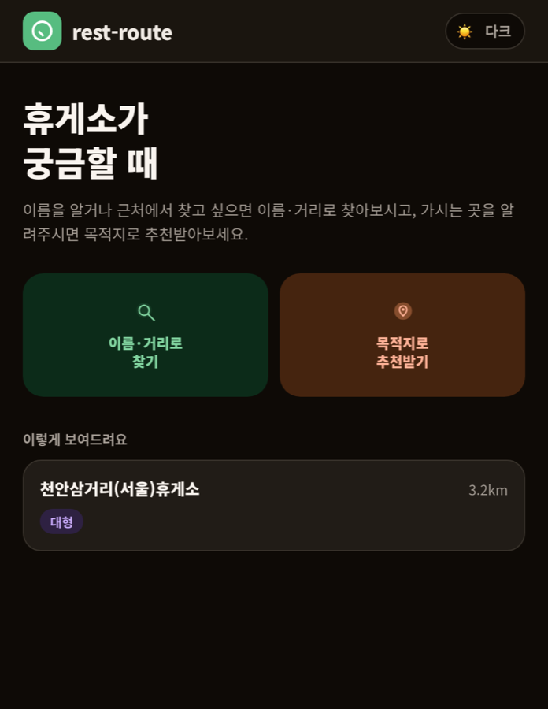
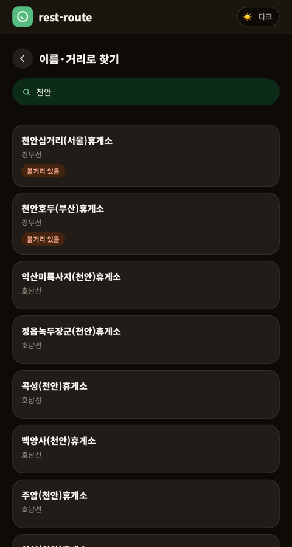
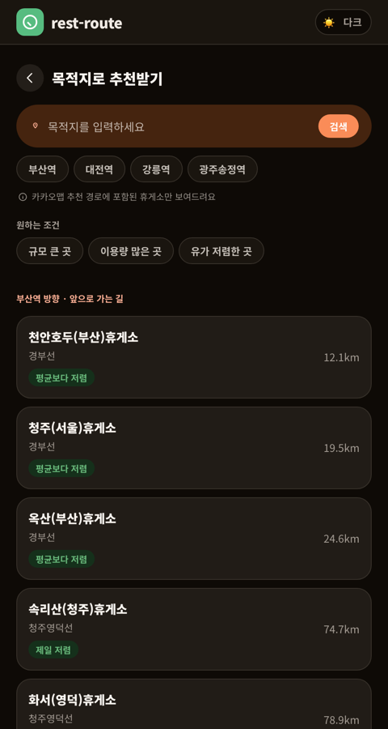
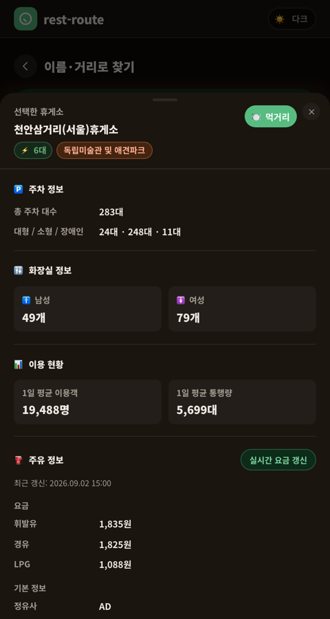
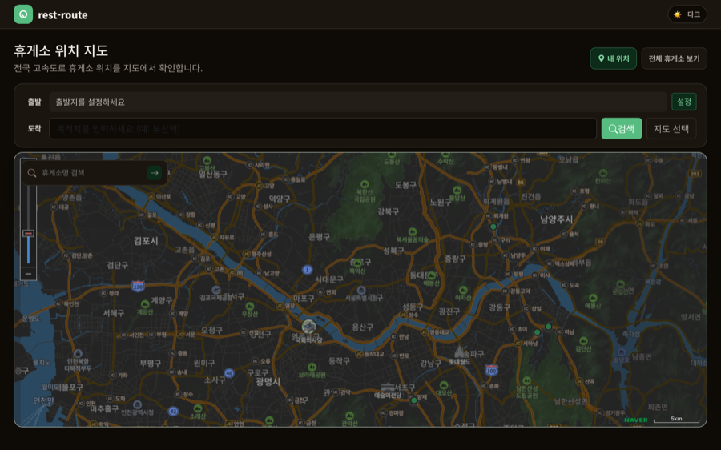
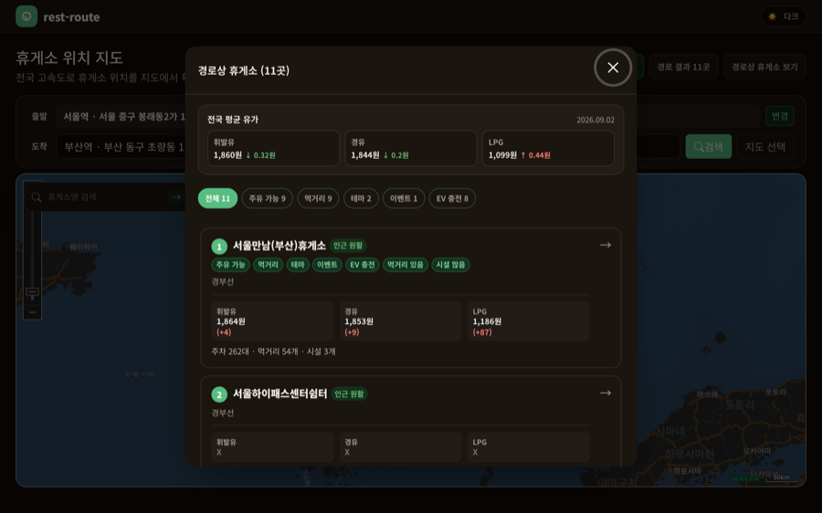

# RestRoute

이동 경로에 있는 고속도로 휴게소를 찾고, 위치·시설·먹거리·주유 정보를 비교하는 Spring Boot 애플리케이션입니다.
모바일에서는 이름·거리·목적지 기준으로 빠르게 찾는 화면 하나만 쓰고, 데스크톱에서는 지도로 전국 휴게소를 살펴봅니다 — 접속 기기에 따라 자동으로 갈립니다.

## 화면

### 모바일

<https://www.rest-route.o-r.kr>에 모바일 기기로 접속하면 자동으로 이 화면이 뜹니다.

랜딩에서 "이름·거리로 찾기"(현재 위치 기준 가까운 순, 이름 검색)와 "목적지로 추천받기"(가는 방향 경로 위 휴게소, 인기 목적지 칩) 중 고릅니다. 규모·이용량·유가·EV 충전 조건에 따라 배지가 붙습니다.

<table>
<tr>
<td><br>랜딩</td>
<td><br>이름·거리로 찾기</td>
<td><br>목적지로 추천받기</td>
<td><br>휴게소 상세</td>
</tr>
</table>

휴게소 하나를 고르면 주차·화장실·이용현황·주유 가격·인기 판매·위치·편의시설·이벤트까지 한 화면에서 볼 수 있습니다.

### 데스크톱

<https://www.rest-route.o-r.kr>에 데스크톱으로 접속하면 뜨는 화면입니다(모바일 기기로 접속하면 대신 위 모바일 화면으로 연결됩니다). 전국 휴게소 위치를 지도로 확인하고, 출발지·목적지를 검색하면 그 경로 위 휴게소를 순서대로 보여줍니다.



출발지·도착지를 검색하면 경로 위 휴게소를 국가 평균 유가, 주유·먹거리·테마·이벤트·EV 충전 필터와 함께 순서대로 보여줍니다. 휴게소 상세 정보는 모바일 화면과 완전히 같은 컴포넌트를 공유합니다 — 어느 화면에서 열어도 같은 정보, 같은 동작입니다.



## 현재 기능

### 지도와 휴게소 상세(데스크톱)

- 네이버 지도에 전국 휴게소 위치와 현재 위치를 표시합니다.
- 휴게소 마커를 선택하면 노선, 방향, 주소, 편의시설, 운영 상태와 주차 정보를 보여줍니다.
- 주유 가격, 정유사, 전화번호와 주유소 편의시설을 상세 정보에 포함합니다.
- 대표 먹거리와 전체 메뉴를 모달에서 확인할 수 있습니다.
- 전기차 충전소가 있는 휴게소인지 경로 결과에서 확인할 수 있고, 상세 화면에서 active 충전기 대수를 보여줍니다.
- 주유 가격은 사용자가 단건 갱신할 수 있으며, 최근 10분 이내 갱신된 값은 외부 API를 다시 호출하지 않습니다.

### 경로상 휴게소 탐색(데스크톱)

- 현재 위치와 사용자가 선택한 목적지를 기준으로 카카오 자동차 경로를 조회합니다.
- 목적지 검색 결과가 여러 개면 이름과 주소를 보여주고 사용자가 직접 선택하게 합니다.
- 경로와 출발·도착 마커를 지도에 표시합니다.
- 기본 1km 범위 안의 휴게소를 경로 순서대로 보여주고, 목록에서 상세 정보로 이동할 수 있습니다.

### 모바일 빠른 탐색

- **이름·거리로 찾기**: 위치를 허용하면 가까운 순으로, 허용하지 않으면 이름 검색만으로 찾습니다. 규모·이용량 상위 10%·볼거리·이벤트 배지와, 선택한 연료/EV 관심에 따른 유가·충전기 배지가 붙습니다.
- **목적지로 추천받기**: 인기 목적지 칩(부산역/대전역/강릉역/광주송정역) 또는 직접 검색으로 목적지를 정하면, 그 방향 경로 위 휴게소를 거리순으로 추천합니다. 규모·이용량은 항상, 유가/EV 충전은 관심 항목에 따라 배지가 붙고, 조건 필터로 좁혀볼 수 있습니다.
- 위치·연료 관심 팝업은 같은 탭 안에서 다시 묻지 않고, 한쪽 화면에서 실제로 위치를 허용하면 다른 화면도 같이 허용된 것으로 기억합니다.
- 결과 카드를 누르면 지도 화면과 동일한 상세 팝업이 페이지 이동 없이 바텀시트로 뜨고, 스와이프로 닫을 수 있습니다.

### 데이터 동기화

- 서버 시작 시 휴게소 위치, 상세, 주유소 편의시설, 주유 가격과 먹거리 테이블이 비어 있으면 초기 데이터를 수집합니다.
- 휴게소 위치·상세·영업시설·주유소 편의시설·먹거리는 매일 자정에 갱신합니다.
- 주유 가격은 3시간마다 갱신합니다.
- 전기차 충전소 정보는 서버 시작 시 비어 있으면 초기화하고 매일 자정에 갱신합니다.
- 외부 API 호출이 실패하면 항목별 오류를 로그에 남기고 다른 동기화 작업을 계속합니다.

## 기술 스택

| 구분 | 기술 |
|---|---|
| Backend | Spring Boot 3.5.0, Java 17 |
| HTTP Client | Spring Cloud OpenFeign |
| Database | H2 file DB, Spring Data JPA |
| Frontend | Thymeleaf, Bootstrap 5, Vanilla JavaScript |
| Map | Naver Maps JavaScript API |
| Place and Route | Kakao Local API, Kakao Mobility Directions API |
| Test | JUnit 5, Spring Boot Test, Node.js test runner, JaCoCo |
| Quality | Checkstyle, Spotless, Palantir Java Format, ESLint, SonarQube |

## Docker 배포

운영 배포는 AWS Lightsail 서버에서 Docker Compose로 실행합니다.
로컬 개발은 기존 H2 설정을 그대로 사용하고, `prod` 프로필에서만 MySQL datasource를 사용합니다.

현재 접속 도메인은 다음과 같습니다.

- 서비스 URL: <https://www.rest-route.o-r.kr>

운영 컨테이너 구성은 다음과 같습니다.

| 서비스 | 컨테이너 | 역할 |
|---|---|---|
| `caddy` | `rest-route-caddy` | 80/443 포트 수신, HTTPS 인증서 자동 발급·갱신, `app:8080` reverse proxy |
| `app` | `rest-route` | Spring Boot 애플리케이션, `prod` 프로필, MySQL datasource 사용 |
| `db` | `rest-route-db` | MySQL 8.4 데이터베이스 |

`Caddyfile`은 `.env`의 `APP_DOMAIN` 값을 사용합니다.

```caddy
{$APP_DOMAIN} {
    reverse_proxy app:8080
}
```

도메인 DNS는 `www.rest-route.o-r.kr`의 A 레코드를 Lightsail public IPv4로 연결합니다.
Lightsail 방화벽에서는 HTTP 80, HTTPS 443 포트를 열어야 하며, Caddy가 Let's Encrypt 인증서를 자동으로 발급·갱신합니다.

### 1. 환경 변수 파일 생성

서버에서 `.env.example`을 복사해 `.env`를 만들고 실제 값을 입력합니다.

```bash
cp .env.example .env
```

필수 값은 다음과 같습니다.

```env
EX_API_KEY=YOUR_EX_API_KEY
NAVER_MAPS_NCP_KEY_ID=YOUR_NAVER_MAPS_NCP_KEY_ID
KAKAO_REST_API_KEY=YOUR_KAKAO_REST_API_KEY
EV_API_KEY=YOUR_EV_API_KEY
APP_DOMAIN=www.rest-route.o-r.kr
MYSQL_DATABASE=vroom
MYSQL_USER=vroom
MYSQL_PASSWORD=STRONG_MYSQL_PASSWORD
MYSQL_ROOT_PASSWORD=STRONG_ROOT_PASSWORD
```

### 2. 애플리케이션 실행

서버에서 이미지를 빌드하고 컨테이너를 백그라운드로 실행합니다.

```bash
docker compose up -d --build
```

배포 후 브라우저에서 <https://www.rest-route.o-r.kr>에 접속합니다.

### 3. 로그 확인

Docker 컨테이너 로그는 다음 명령으로 확인합니다.

```bash
docker compose logs -f app
docker compose logs -f caddy
docker compose logs -f db
```

애플리케이션 파일 로그는 서버의 `./logs` 디렉터리에 날짜별로 저장됩니다.

```text
logs/yyyyMMdd.log
```

### 4. 데이터와 인증서 보관

- MySQL 데이터는 Docker volume `mysql-data`에 유지됩니다.
- Caddy 인증서와 설정 캐시는 Docker volume `caddy-data`, `caddy-config`에 유지됩니다.
- 애플리케이션 로그는 compose volume mount로 서버의 `./logs` 디렉터리에 남습니다.

## CI/CD

GitHub Actions로 테스트와 배포를 분리해서 운영합니다.

| 워크플로우 | 트리거 | 동작 |
|---|---|---|
| `ci.yml` | main에 push 또는 PR | `./gradlew test` 실행, 실패 시 테스트 리포트를 아티팩트로 업로드 |
| `deploy.yml` | main에 PR이 머지될 때 | SSH로 Lightsail 서버에 접속해 `git pull origin main` 후 `docker compose up -d --build app` 실행 |

`deploy.yml`은 `app` 컨테이너만 재빌드·재시작하며, `db`와 `caddy` 컨테이너는 배포마다 재시작하지 않고 계속 유지됩니다.

```yaml
- name: Deploy to Lightsail
  uses: appleboy/ssh-action@v1.2.5
  with:
    host: ${{ secrets.LIGHTSAIL_HOST }}
    username: ${{ secrets.LIGHTSAIL_USER }}
    key: ${{ secrets.LIGHTSAIL_SSH_KEY }}
    script: |
      cd ~/vroom-tracker
      git pull origin main
      docker compose up -d --build app
```

서버 접속 정보(`LIGHTSAIL_HOST`, `LIGHTSAIL_USER`, `LIGHTSAIL_SSH_KEY`)는 GitHub repo secrets로 관리하며, 배포 전용 SSH 키는 서버의 `~/.ssh/authorized_keys`에 공개키만 등록해 사용합니다.

## 검증

백엔드 테스트와 품질 검사를 실행합니다.

```bash
./gradlew check
```

프론트엔드 검사를 실행합니다.

```bash
npm ci
npm run lint
npm run test:js
```

전체 JaCoCo line coverage 최소 기준은 95%이며, 하네스는 변경 실행 라인과 변경 조건 분기의 100% 검증도 확인합니다.

## 주요 문서

| 문서 | 역할 |
|---|---|
| `PRODUCT.md` | 제품 범위와 합의된 방향 |
| `USER_INSIGHTS.md` | 사용자 유형, 행동 가설과 브레인스토밍 질문 |
| `DATA.md` | 외부 데이터 저장 방식과 테이블 연결 키 |
| `ARCHITECTURE.md` | 레이어 책임과 제어 흐름 원칙 |
| `API.md` | 외부 연동 실측과 내부 API 계약 |
| `QUALITY.md` | 테스트와 품질 기준 |
